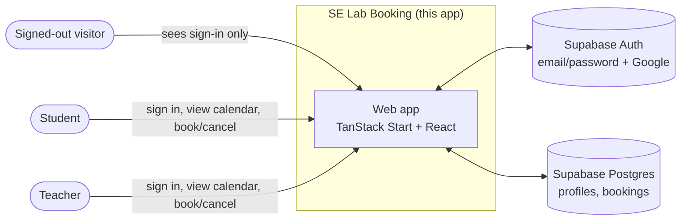

# Diagram 1 — System context

Signed-out visitors reach only the sign-in screen; the live calendar and
booking actions require an authenticated session (`src/routes/index.tsx`).
Booking holder identity (**student ID + role**, agreed 9 Sep 2026) is shown
to signed-in users only and not to signed-out visitors.
