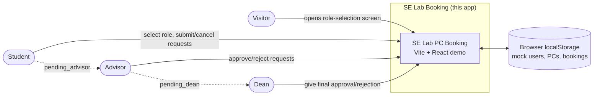

# Diagram 1 — System context

This repository currently delivers a frontend-only demo. The login screen
selects one of three seeded roles; it is a demo role selector, not real authentication. Booking
data is persisted in the browser with `localStorage`, and the planned
Supabase Auth/Postgres implementation is described in `agent.md`.
