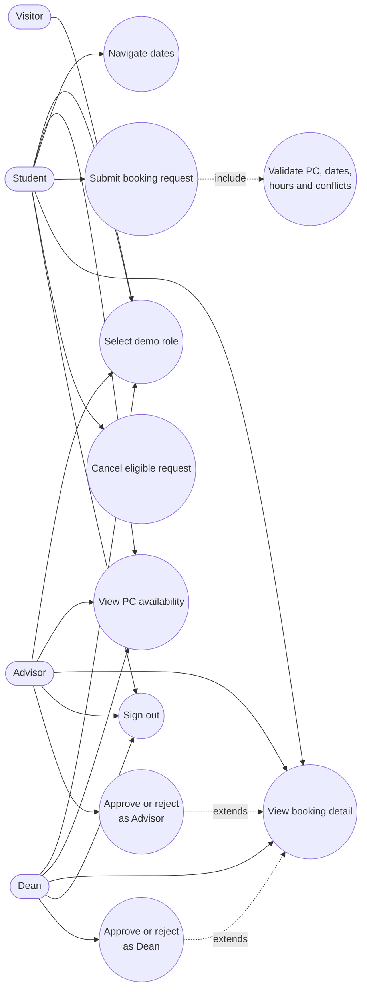

# Diagram 2 — Use case diagram

Students submit requests after the form validates the PC, dates, hours, and
conflicts. Advisors handle `pending_advisor` requests, then Deans handle
`pending_dean` requests. The demo uses role-based route guards and seeded
roles; production authorization and authentication remain planned backend
work.
