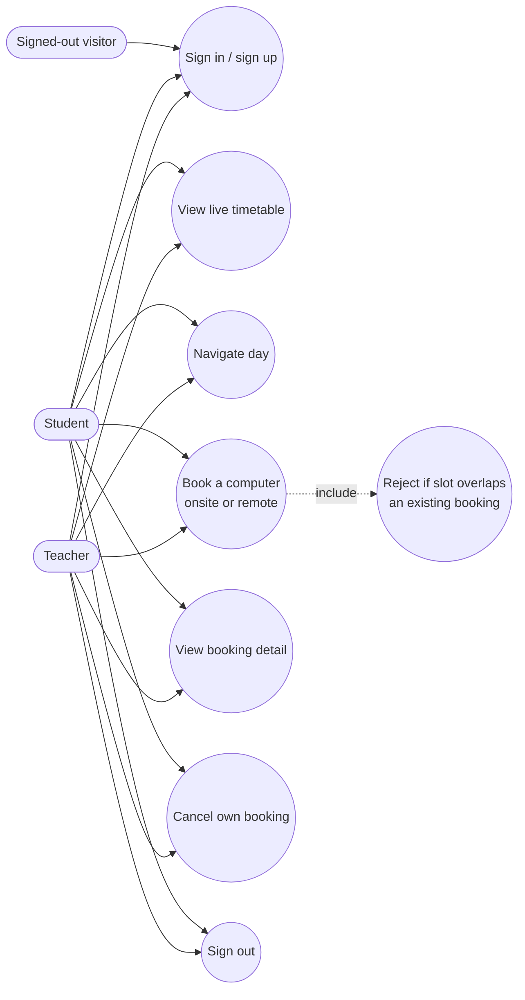

# Diagram 2 — Use case diagram

Students and teachers share the exact same use cases — there's no separate
admin role in the current build; a booking's role label (student/teacher)
is informational, not a permission gate.
