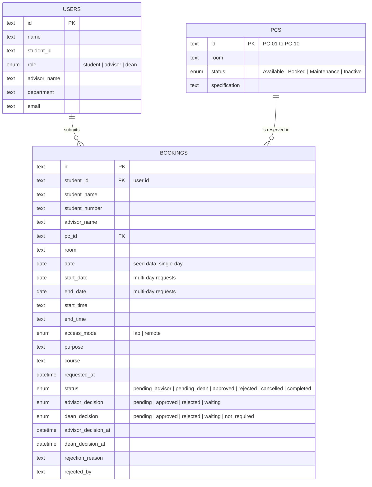

# Diagram 3 — Entity-relationship diagram

Describes the data model used by the current frontend demo.

Notes:

- The demo stores seeded user, PC, and booking objects in browser
  `localStorage`; it has no live database or persistent user table.
- Existing seed bookings use `date`; newly created bookings use
  `startDate`/`endDate`, with the utility layer supporting both shapes.
- New requests start at `pending_advisor`, move to `pending_dean`, and then
  become `approved` or `rejected`.
- Advisor and Dean decisions are stored on the booking object rather than in
  a separate approval-history entity.
- `isBookingConflict` blocks overlapping `pending_advisor`, `pending_dean`,
  and `approved` bookings for the same PC and date range.
- Supabase tables, RLS, and server-side conflict enforcement are planned for
  a later phase.
