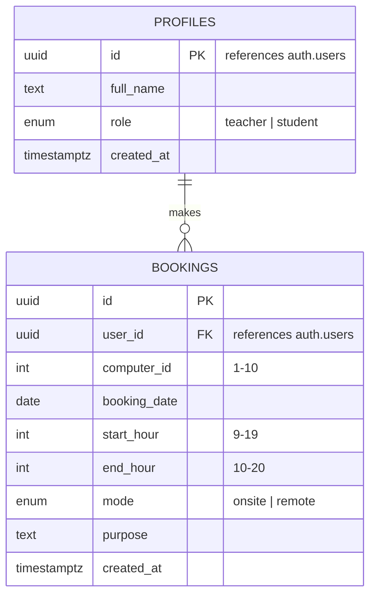

# Diagram 3 — Entity-relationship diagram

Matches the live schema in `supabase/migrations/`.

Notes:
- `UNIQUE`/overlap enforcement isn't a simple unique constraint — a
  `BEFORE INSERT OR UPDATE` trigger (`prevent_booking_overlap`) rejects any
  new/edited booking whose `[start_hour, end_hour)` overlaps an existing
  booking on the same `computer_id` + `booking_date`.
- Row-Level Security: `bookings` and `profiles` are readable by everyone
  (`anon` + `authenticated`) so the calendar is genuinely public/live, but
  only the owning `user_id` can insert/update/delete their own booking.
