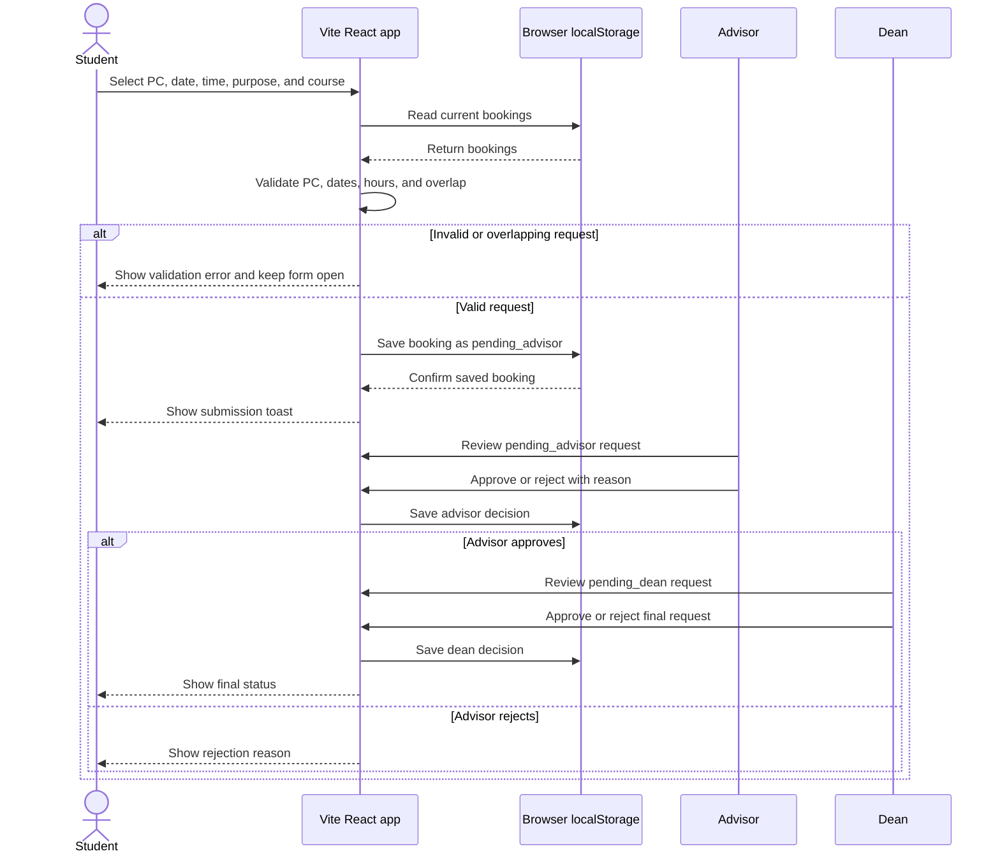

# Diagram 4 — Sequence diagram: booking a computer

This sequence describes the current demo. Its conflict check is local to the
browser, so it is not concurrency-safe across different users or devices.
The planned Supabase phase must move the overlap rule and role authorization
to the server/database.
