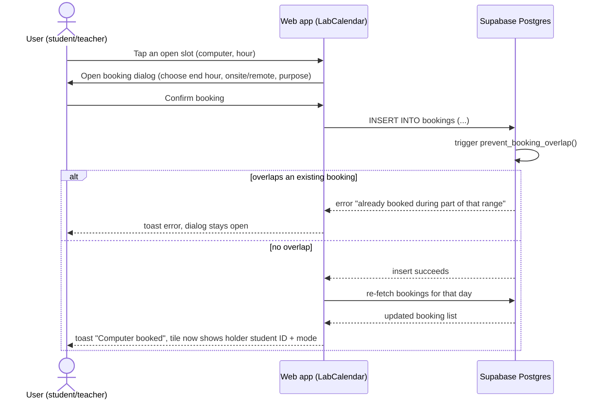

# Diagram 4 — Sequence diagram: booking a computer

This is the mechanism that makes the shared calendar trustworthy: even if
two users submit conflicting bookings at nearly the same instant, the
database trigger — not client-side logic — is the single source of truth
that rejects the second one.
