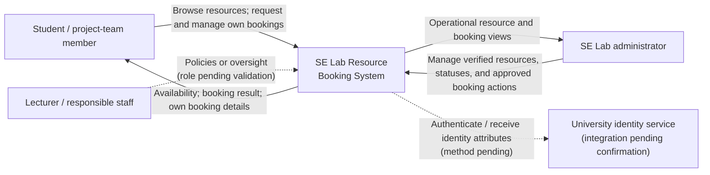

# Diagram 1 — System Context

Status: **To Be Validated** (`DGM-01`). External services and data exchanges are candidates, not confirmed integrations.

## Boundary Notes

- The system covers High-Performance PCs, iMacs, Standard PCs, and Meeting Rooms.
- Identity integration, notifications, and lecturer access have not been confirmed.
- The public availability view should not expose unnecessary personal data.
- Relevant requirements: REQ-001, REQ-002, REQ-013–REQ-016, REQ-019, REQ-020.

## Questions for Validation

- Which people are eligible to book or administer each resource?
- Is there an existing university sign-in service the project must use?
- Do staff require direct system access or only reports/policy ownership?
- Are notifications in scope, and through which approved channel?
