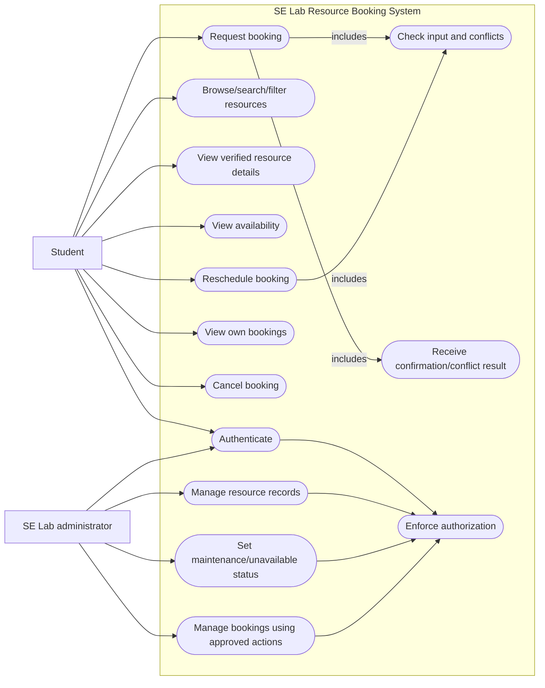

# Diagram 2 — Candidate Use Cases

Status: **To Be Validated** (`DGM-02`). The diagram shows proposed responsibilities, not confirmed stakeholder requirements.

## Coverage

- Student use cases: REQ-001–REQ-012, REQ-017–REQ-020.
- Administrative use cases: REQ-013–REQ-016, REQ-019, REQ-020.
- “Approved actions” is intentionally non-specific until policy and interview evidence are collected.
