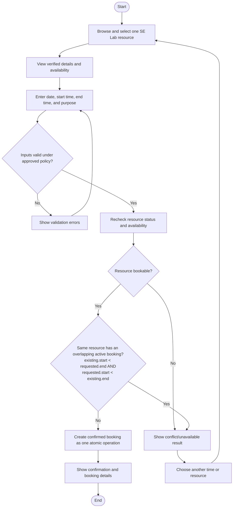

# Diagram 3 — Booking and Conflict Activity

Status: **To Be Validated** (`DGM-03`). This diagram applies the same candidate conflict rule to every resource category.

## Candidate Rule Examples

| Existing | Requested | Candidate result |
|---|---|---|
| PC-01, 10:00–12:00 | PC-01, 11:00–13:00 | Conflict |
| PC-01, 10:00–12:00 | PC-02, 11:00–13:00 | No conflict from the PC-01 booking |
| ROOM-01, 10:00–12:00 | ROOM-01, 12:00–13:00 | No overlap under `[start, end)` intervals |

## Decisions Still Needed

- Which booking statuses count as active
- Whether buffers are required between uses
- Operating hours, duration limits, quotas, approval steps, and recurrence
- How concurrent requests are serialized in the eventual implementation
- Whether an administrator can ever override a conflict

Relevant requirements: REQ-006–REQ-009, REQ-012, REQ-017.
