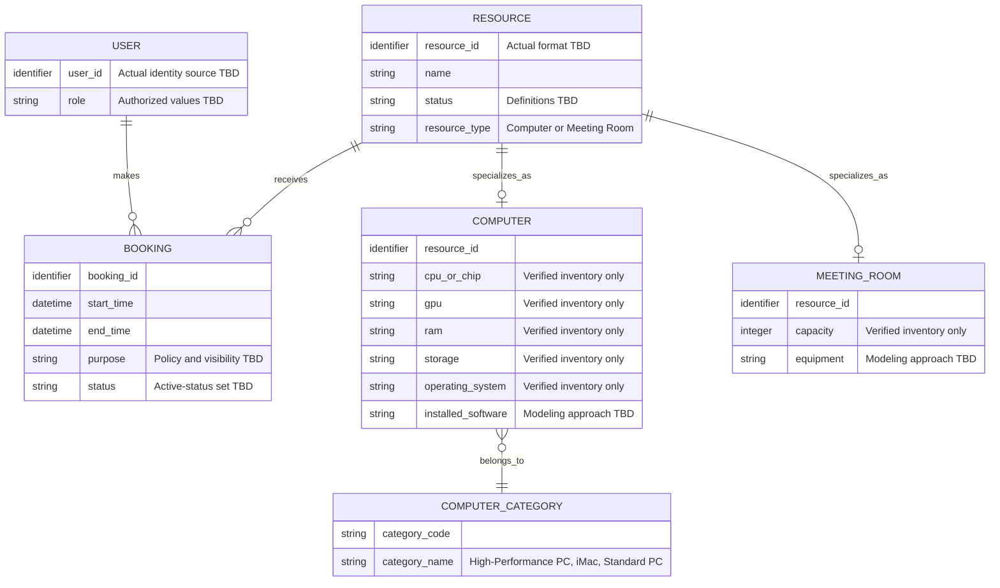

# Diagram 4 — Conceptual Domain Model

Status: **To Be Validated** (`DGM-04`). This is a discovery-level domain model, not a finalized database schema. Attribute types, identifiers, optionality, retention, and audit fields remain open.

## Model Invariants — Candidates

- Every bookable item is an `RESOURCE` and is exactly one of `COMPUTER` or `MEETING_ROOM`; the exact enforcement method is undecided.
- Each computer belongs to one of three categories: High-Performance PC, iMac, or Standard PC.
- A booking refers to exactly one user and one resource.
- `end_time` must be after `start_time`.
- Active bookings for the same resource must not overlap.
- A booking for one resource does not block another resource.
- Resource details must come from verified SE Lab inventory.

## Open Modeling Questions

- Should software and room equipment be normalized into searchable capability records?
- Which booking states exist, and which participate in conflict checks?
- Are maintenance periods a resource status, a time-bounded unavailability record, or both?
- Which timestamps/audit facts are required by actual policy and Week 2 compliance evidence?
- What user attributes can be stored, for how long, and for what approved purpose?

Relevant requirements: REQ-002, REQ-004–REQ-008, REQ-010–REQ-015, REQ-018–REQ-020.
